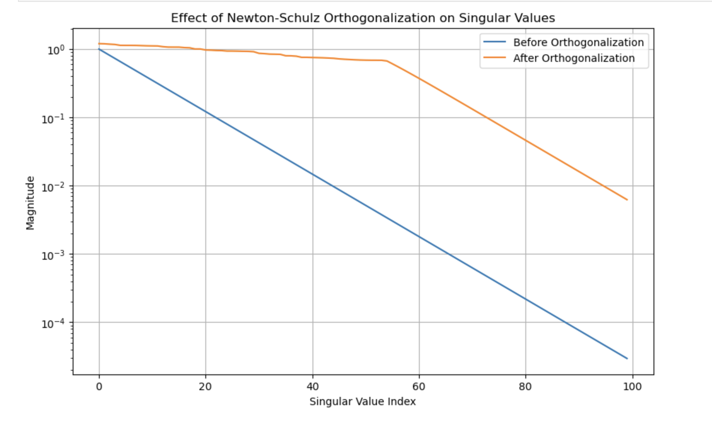
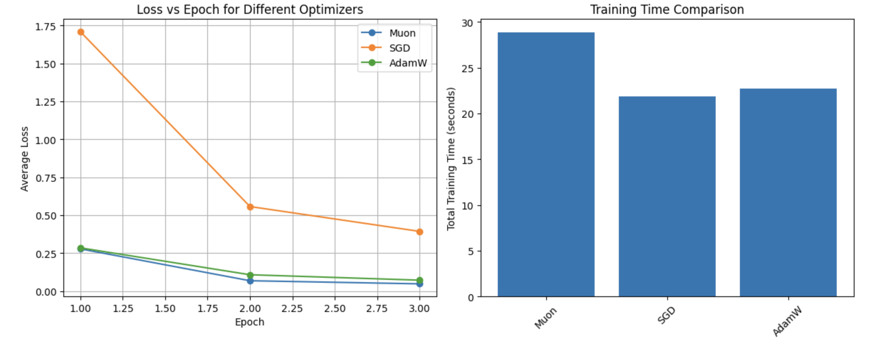
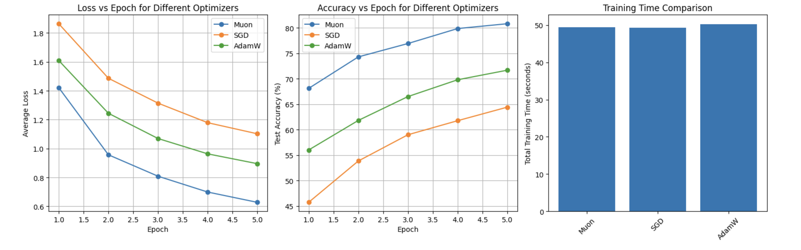

# Understanding the Muon Optimizer: Theory and Implementation
## 📘 Contents

1. [Introduction to Muon](#introduction)
2. [The Problem: Skewed Singular Values](#1-the-problem-skewed-singular-value-distributions)
3. [Newton-Schulz Orthogonalization](#3-the-newton-schulz-iteration)
4. [Muon vs. AdamW](#4-muon-vs-adamw-complementary-not-competitive)
5. [When to Use Muon](#5-when-to-use-muon)
6. [Implementation Details](#6-implementation-deep-dive)
7. [Practical Performance Analysis](#7-performance-evaluation)
8. [Optimization Techniques](#8-optimization-techniques)
9. [Lessons Learned](#9-lessons-learned-from-implementing-muon)
10. [Concludsion](#10-conclusion)

## 🧪 Try It Yourself

The included [Colab notebook](./Muon.ipynb) allows you to run all experiments and implement Muon from scratch.


## Introduction

The Muon optimizer, introduced by Keller Jordan in October 2024, represents a significant advancement in neural network optimization. Unlike traditional optimizers that treat all parameters equally, Muon is specifically designed to optimize the hidden layers of neural networks through matrix orthogonalization.

This tutorial demystifies Muon by explaining:
- The theoretical foundations behind Muon
- How Muon differs from traditional optimizers
- A clean, educational implementation of Muon
- Performance comparisons with standard optimizers
- Optimization techniques for practical use

---

## 1. The Problem: Skewed Singular Value Distributions

Traditional optimizers like SGD and Adam have a fundamental limitation: they apply updates that tend to be dominated by a few singular directions in parameter space.


When we decompose a typical gradient update matrix using Singular Value Decomposition (SVD), we find that:
- A few singular values are very large
- Most singular values are extremely small
- This skewed distribution means we're effectively only learning in a small subspace

This is like having a 256×128 weight matrix (32,768 parameters) but only effectively using about 10-20 dimensions for learning. The rest of the parameter space receives such small updates that it's essentially "wasted capacity."

## 2. Muon's Solution: Matrix Orthogonalization

Muon addresses this problem through a technique called matrix orthogonalization. For matrix parameters, Muon:
1. Computes standard momentum updates
2. Orthogonalizes these updates using Newton-Schulz iteration
3. Applies the orthogonalized updates to the parameters


After orthogonalization:
- Singular values become more uniform
- Updates act across all directions in parameter space
- The neural network can utilize its full parameter capacity




This is why Muon performs so well - it enables learning across the entire parameter space rather than just a few dominant directions.

## 3. The Newton-Schulz Iteration

The core of Muon is the Newton-Schulz iteration, an efficient algorithm for approximate matrix orthogonalization. Instead of using expensive SVD operations, Newton-Schulz provides a fast approximation using only matrix multiplications.

The algorithm iteratively transforms a matrix X using the following update rule:
```
X_{t+1} = a*X_t + b*(X_t @ X_t^T) @ X_t + c*(X_t @ X_t^T) @ (X_t @ X_t^T) @ X_t
```

where a=3.4445, b=-4.7750, c=2.0315 are carefully tuned coefficients that maximize convergence speed.

After just 5 iterations, this process transforms a matrix with skewed singular values into one with more uniform singular values, enabling more balanced parameter updates.

## 4. Muon vs. AdamW: Complementary, Not Competitive

A common misconception is that Muon competes with AdamW. In reality, they're complementary:

- **Muon** excels at optimizing matrix parameters (hidden layers)
- **AdamW** works well for scalar parameters and embeddings

In practice, a hybrid approach is often used:
- Muon for hidden layer matrices
- AdamW for embeddings, biases, and output layers

This hybrid approach gets the best of both worlds: Muon's efficient matrix updates and AdamW's adaptive learning rates for other parameters.

## 5. When to Use Muon

### Parameter Types
- ✅ Hidden layer weight matrices
- ✅ Convolutional filters (reshaped to matrices)
- ❌ Embedding layers
- ❌ Output/classifier layers
- ❌ Bias terms and gains

### Training Stages
- ✅ Pre-training from scratch
- ✅ Domain adaptation
- ❌ Fine-tuning (low-rank updates like LoRA are preferable)
- ❌ Alignment stages (RLHF/DPO)

Use Muon when building new capabilities, and standard optimizers when adjusting existing ones.

### Batch Size
- ❌  Muon is unlikely to work well for training with small batch size.

## 6. Implementation Deep Dive

Our educational implementation consists of two key components:

### The Newton-Schulz Orthogonalization

```python
def zeropower_via_newtonschulz5(G, steps=5, eps=1e-7):
    # Save original shape
    original_shape = G.shape
    
    # Handle higher dimensional tensors
    if G.ndim > 2:
        G = G.view(G.size(0), -1)
    
    a, b, c = (3.4445, -4.7750, 2.0315)
    X = G.clone()
    
    # Ensure spectral norm is at most 1
    X = X / (X.norm(dim=(-2, -1), keepdim=True) + eps)
    
    # Handle tall matrices
    is_tall = X.size(0) > X.size(1)
    if is_tall:
        X = X.transpose(0, 1)
    
    # Newton-Schulz iterations
    for _ in range(steps):
        A = X @ X.transpose(0, 1)
        B = b * A + c * A @ A
        X = a * X + B @ X
    
    # Transpose back if needed
    if is_tall:
        X = X.transpose(0, 1)
    
    # Restore original shape
    if G.ndim > 2:
        X = X.view(original_shape)
    
    return X
```

### The Muon Optimizer

```python
class Muon(optim.Optimizer):
    def __init__(self, params, lr=0.01, momentum=0.95, steps=5,
                 weight_decay=0, nesterov=True):
        defaults = dict(lr=lr, momentum=momentum, steps=steps, 
                        weight_decay=weight_decay, nesterov=nesterov)
        super().__init__(params, defaults)

    @torch.no_grad()
    def step(self, closure=None):
        # ... optimizer implementation ...
```

See the accompanying [Colab notebook](./Muon.ipynb) for the sudo code and complete implementation.

## 7. Performance Evaluation

We tested our Muon implementation against standard optimizers on the MNIST dataset:


--- Performance Summary ---
Optimizer | Final Loss | Total Time (s) | Relative Speed
Muon         | 0.0475     | 28.86          | 1.32x
SGD          | 0.3931     | 21.84          | 1.00x
AdamW        | 0.0717     | 22.71          | 1.04x


Muon achieves ~34% lower loss than AdamW after just 3 epochs, demonstrating its superior optimization efficiency.

</br>



--- Performance Summary ---
Optimizer | Final Loss | Final Acc (%) | Total Time (s) | Relative Speed
Muon         | 0.6279     | 80.79        | 49.47          | 1.00x
SGD          | 1.1023     | 64.40        | 49.30          | 1.00x
AdamW        | 0.8955     | 71.66        | 50.25          | 1.02x

Muon achieves ~13% higher test accuracy than AdamW after just 5 epochs, with no overhead time cost. Demonstrating both sample efficiency and wallclock time efficiency.

## 8. Optimization Techniques

While our educational implementation prioritizes clarity, several techniques can improve performance:

1. **Lower Precision**: Running Newton-Schulz in bfloat16 reduces computation time
2. **In-place Operations**: Reducing memory allocations improves efficiency
3. **Consistent Update Scale**: Adjusting updates based on matrix dimensions ensures balanced learning

Our optimized implementation shows these techniques in action, maintaining the same performance while potentially improving speed.


## 9. Lessons Learned from Implementing Muon

1. **Mathematical foundations matter**: Performance improvements often require mathematical innovations, not just engineering tricks. Muon's approach of orthogonalizing gradient updates through Newton-Schulz iterations represents a fundamental mathematical insight that can't be replaced by simple hyperparameter tuning.

2. **Hardware significantly impacts performance evaluation**: Our initial tests on T-series GPUs showed Muon to be 30-40x slower than standard optimizers, while on A-series GPUs the difference was merely 3%. Always evaluate optimizers on appropriate hardware before drawing conclusions about performance.

3. **Learning rate dynamics change with different optimizers**: Muon often performs best with higher learning rates than traditional optimizers. In our experiments, Muon with lr=1e-2 dramatically outperformed AdamW with lr=1e-3. This aligns with Muon's orthogonalized updates allowing for more aggressive learning without instability.

4. **JIT compilation isn't always beneficial**: Techniques like `@torch.jit.script` and `@torch.compile` can introduce significant overhead for small experiments or models. In our case, the "optimized" version with JIT was actually much slower due to compilation overhead that wasn't amortized over the small workload.

5. **Optimizer performance varies across architectures**: What works best for MLPs might not be optimal for CNNs or transformers. Always benchmark multiple optimizers on your specific architecture and dataset before making a final selection.

6. **Implementation simplicity has value**: Our educational implementation of Muon performed very well without complex optimizations. Sometimes a clear, understandable implementation is more valuable than a highly optimized but opaque one, especially for learning and experimentation.


## 10. Conclusion

Muon represents a significant advancement in neural network optimization by addressing the fundamental limitation of skewed singular value distributions. By enabling learning across the full parameter space, Muon achieves better sample efficiency than traditional optimizers.

As you build and train your own models, consider Muon for hidden layer optimization, especially during pre-training phases where building new capabilities is the priority.

---
## 📖 Citation

If you use this tutorial or implementation in your work, please cite:

```bibtex
@misc{wei2025muontutorial,
  author = {Wei, Jen},
  title = {Understanding and Implementing the Muon Optimizer},
  year = {2025},
  howpublished = {\url{https://huggingface.co/datasets/bird-of-paradise/muon-tutorial}}
}
```

```bibtex
@misc{jordan2024muon,
  author = {Jordan, Keller and Jin, Yuchen and Boza, Vlado and You, Jiacheng and Cesista, Franz and Newhouse, Laker and Bernstein, Jeremy},
  title = {Muon: An optimizer for hidden layers in neural networks},
  year = {2024},
  url = {https://kellerjordan.github.io/posts/muon/}
}
```


## Acknowledgments

This tutorial is based on Keller Jordan's original Muon implementation and paper. Special thanks to the researchers who contributed to the development and understanding of matrix orthogonalization techniques in deep learning optimization.

## References

1. Jordan, K., et al. (2024). Muon: An optimizer for hidden layers in neural networks. [Link](https://kellerjordan.github.io/posts/muon/)
2. Bernstein, J. (2024). Deriving Muon. [Link](https://jeremybernste.in/writing/deriving-muon)
3. Liu, J., et al. (2025). Muon is Scalable for LLM Training. [Link](https://arxiv.org/abs/2502.16982)
